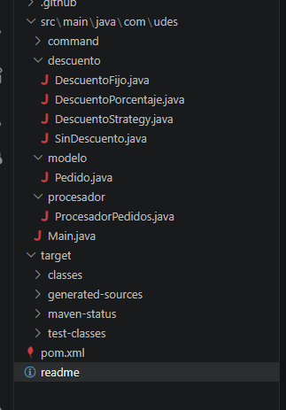
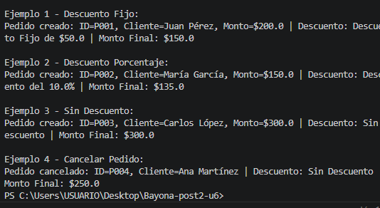

autor: esteban mauricio calderon 02220132006
# Refactorización de Sistema de Pedidos - Unidad 6

Este proyecto corresponde al **Post-Contenido 2 de la Unidad 6**. El objetivo principal fue identificar y eliminar el **Spaghetti Code** en un sistema de procesamiento de pedidos, aplicando patrones de diseño para mejorar la mantenibilidad y reducir la complejidad ciclomática.

##  Tecnologías Utilizadas

##  Patrones de Diseño Aplicados

### 1. Patron Strategy
Se utilizó para encapsular las diferentes reglas de negocio relacionadas con los descuentos. Antes, estas reglas estaban mezcladas en múltiples bloques `if-else`.
* **Interfaz:** `DescuentoStrategy`
* **Implementaciones:** `DescuentoFijo`, `DescuentoPorcentaje`, `SinDescuento`.

### 2. Patron Command
Se implementó para desacoplar la ejecución de operaciones sobre los pedidos (crear, cancelar) de la lógica principal del sistema.
* **Interfaz:** `PedidoCommand`
* **Implementaciones:** `CrearPedidoCommand`, `CancelarPedidoCommand`.

## 📸 Evidencias de Funcionamiento

### Estructura de Paquetes
Se organizó el código siguiendo el principio de responsabilidad única (SRP):

### Ejecución en Terminal
Prueba de que el sistema compila y aplica los descuentos correctamente:

